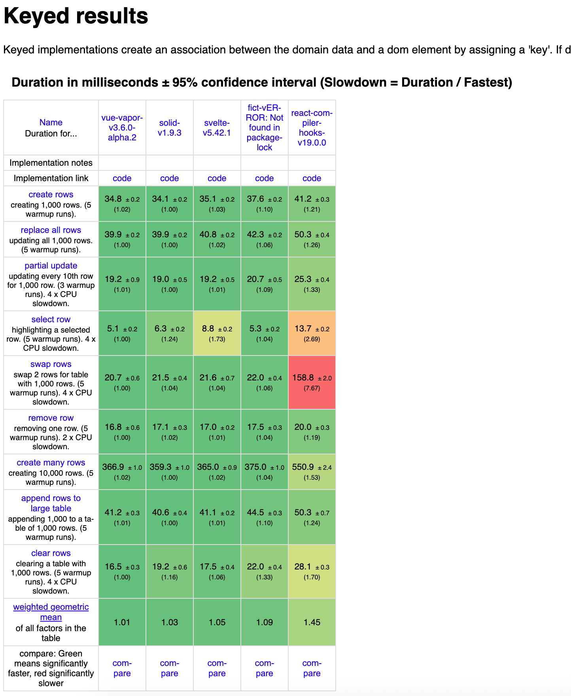

# Fict


> Reactive UI with zero boilerplate.

Fict is a UI library where you write plain JavaScript and the compiler figures out the reactivity.

> Write JavaScript; let the compiler handle signals, derived values, and DOM updates. It’s a new way to think about UI—not a drop-in replacement for React/Vue/Svelte. The promise is less code and lower cognitive load.

```jsx
function Counter() {
  let count = $state(0)
  const doubled = count * 2 // auto-derived, no useMemo needed

  return <button onClick={() => count++}>{doubled}</button>
}
```

**No `useMemo`. No dependency arrays. No `.value`. Just JavaScript.**

---

## Why Fict?

**Positioning**

- “Write JavaScript; the compiler handles reactivity.” No `.value`, no deps arrays, no manual memo wiring (no explicit unwrap/getter calls).
- Not pitching “better React/Vue/Svelte”; Fict is a different mental model (compile-time reactivity on plain JS).
- The gain: less code, lower cognitive overhead. Performance is surgical by design, but we’re not selling unproven speed charts.

| Pain Point        | React                          | Vue 3                                                            | Solid                         | Svelte 5                  | Fict          |
| ----------------- | ------------------------------ | ---------------------------------------------------------------- | ----------------------------- | ------------------------- | ------------- |
| State syntax      | `useState()` + setter          | `ref()` + `.value` (JS) / template auto-unwrap / or `reactive()` | `createSignal()` + `()` calls | `$state()`                | `$state()`    |
| Derived values    | `useMemo` + deps (or Compiler) | `computed()`                                                     | `createMemo()`                | `$derived()`              | **automatic** |
| Props destructure | ✅                             | ⚠️ usually breaks reactivity                                     | ❌ (breaks reactivity)        | ✅ (`$props()` semantics) | ✅            |
| Control flow      | native JS                      | typically `v-if`/`v-for`                                         | typically `<Show>/<For>`      | `{#if}/{#each}`           | native JS     |

Fict gives you:

- **React's familiar syntax** — JSX, destructuring-friendly, native `if`/`for`, etc.
- **Solid's fine-grained update model** — no VDOM, surgical DOM updates
- **Less boilerplate than both** — compiler infers derived values automatically (when possible)

---

## Quick Start

```bash
npm install fict
npm install -D @fictjs/vite-plugin  # Vite users
```

**Counter App:**

```tsx
import { $state, render } from 'fict'

export function Counter() {
  let count = $state(0)
  const doubled = count * 2 // auto-derived, no useMemo needed

  return (
    <div class="counter">
      <h1>Fict Counter</h1>
      <div class="card">
        <button onClick={() => count--}>-</button>
        <span class="count">{count}</span>
        <button onClick={() => count++}>+</button>
      </div>
      <p class="doubled">Doubled: {doubled}</p>
    </div>
  )
}

render(() => <Counter />, document.getElementById('app')!)
```

**Vite setup:**

```ts
// vite.config.ts
import { defineConfig } from 'vite'
import fict from '@fictjs/vite-plugin'

export default defineConfig({
  plugins: [fict()],
})
```

**TypeScript:**

```json
{
  "compilerOptions": {
    "jsx": "preserve",
    "jsxImportSource": "fict"
  }
}
```

---

## Online Examples

- [Counter](https://stackblitz.com/edit/vite-fict-ts?file=src%2Fmain.tsx)

## Core Concepts

### `$state` — Reactive data

```ts
let count = $state(0)

count++ // ✅ direct mutation
count = count + 1 // ✅ assignment
```

### Automatic derivations — No `useMemo` needed

```ts
let price = $state(100)
let quantity = $state(2)

const subtotal = price * quantity // auto-derived
const tax = subtotal * 0.1 // auto-derived
const total = subtotal + tax // auto-derived
```

The compiler builds a dependency graph and only recomputes what's needed.

### `$effect` — Side effects

```ts
$effect(() => {
  console.log('count is now', count)
  return () => {
    /* cleanup */
  }
})
```

---

## Execution Model: Not React, Not Solid

**This is the most important concept to understand.**

```tsx
function Counter() {
  console.log('A') // 🔵 Runs ONCE
  let count = $state(0)
  const doubled = count * 2
  console.log('B', doubled) // 🟢 Runs on EVERY count change
  return (
    <button onClick={() => count++}>
      {(console.log('C'), doubled)} {/* 🟢 Runs on every change */}
      {(console.log('D'), 'static')} {/* 🔵 Runs ONCE */}
    </button>
  )
}
```

**Initial render:** `A → B 0 → C → D`

**After click (count: 0 → 1):** `B 2 → C` (A and D don't run!)

### The mental model

| Framework | What happens on state change                                     |
| --------- | ---------------------------------------------------------------- |
| React     | Entire component function re-runs                                |
| Solid     | Component runs once; you manually wrap derived values            |
| **Fict**  | Component runs once; **code depending on state** auto-recomputes |

Fict splits your component into "reactive regions":

- Code before `$state`: runs once
- Expressions using state (`count * 2`): recompute when dependencies change
- Static JSX: runs once

---

## Examples

### Conditional rendering

```tsx
function App() {
  let show = $state(true)

  return (
    <div>
      {show && <Modal />}
      {show ? <A /> : <B />}
    </div>
  )
}
```

No `<Show>` or `{#if}` — just JavaScript.

### List rendering

```tsx
function TodoList() {
  let todos = $state([
    { id: 1, text: 'Learn Fict' },
    { id: 2, text: 'Build something' },
  ])

  return (
    <ul>
      {todos.map(todo => (
        <li key={todo.id}>{todo.text}</li>
      ))}
    </ul>
  )
}
```

No `<For>` or `v-for` — just `.map()`.

### Async data fetching

```tsx
function UserProfile({ userId }: { userId: string }) {
  let user = $state<User | null>(null)
  let loading = $state(true)

  $effect(() => {
    const controller = new AbortController()
    loading = true

    fetch(`/api/user/${userId}`, { signal: controller.signal })
      .then(res => res.json())
      .then(data => {
        user = data
        loading = false
      })

    return () => controller.abort() // cleanup on userId change
  })

  if (loading) return <Spinner />
  return <div>{user?.name}</div>
}
```

### Props stay reactive

```tsx
function Greeting({ name, age = 18 }: { name: string; age?: number }) {
  const label = `${name} (${age})` // auto-derived from props
  return <span>{label}</span>
}
```

Destructuring works. No `toRefs()` or special handling needed.

---

## What Fict Compiles To

```tsx
// Your code
function Counter() {
  let count = $state(0)
  const doubled = count * 2
  return <div>{doubled}</div>
}

// Compiled output (simplified)
function Counter() {
  const [count, setCount] = createSignal(0)
  const doubled = createMemo(() => count() * 2)

  const div = document.createElement('div')
  createEffect(() => {
    div.textContent = doubled()
  })
  return div
}
```

You write the simple version. The compiler generates the efficient version.

---

## Advanced Features

### Error Boundaries

```tsx
import { ErrorBoundary } from 'fict'
;<ErrorBoundary fallback={err => <p>Error: {String(err)}</p>}>
  <RiskyComponent />
</ErrorBoundary>
```

### Suspense

```tsx
import { Suspense } from 'fict'
import { resource, lazy } from 'fict/plus'

const userResource = resource({
  suspense: true,
  fetch: (_, id: number) => fetch(`/api/user/${id}`).then(r => r.json()),
})

const LazyChart = lazy(() => import('./Chart'))

function Profile({ id }) {
  return (
    <Suspense fallback="Loading...">
      <h1>{userResource.read(() => id).data?.name}</h1>
      <LazyChart />
    </Suspense>
  )
}
```

### `fict/plus` — Advanced APIs

```tsx
import { $store, resource, lazy } from 'fict/plus'
import { untrack } from 'fict'

// Deep reactivity with path-level tracking
const user = $store({ name: 'Alice', address: { city: 'London' } })
user.address.city = 'Paris' // fine-grained update

// Derived values are auto-memoized, just like $state
const greeting = `Hello, ${user.name}` // auto-derived

// Method chains are also auto-memoized
const store = $store({ items: [1, 2, 3, 4, 5] })
const doubled = store.items.filter(n => n > 2).map(n => n * 2) // auto-memoized

// Dynamic property access works with runtime tracking
const value = store[props.key] // reactive, updates when key or store changes

// Escape hatch for black-box functions
const result = untrack(() => externalLib.compute(count))
```

**`$store` vs `$state`:**

| Feature        | `$state`                   | `$store`                 |
| -------------- | -------------------------- | ------------------------ |
| Depth          | Shallow                    | Deep (nested objects)    |
| Access         | Direct value               | Proxy-based              |
| Mutations      | Reassignment               | Direct property mutation |
| Derived values | Auto-memoized              | Auto-memoized            |
| Best for       | Primitives, simple objects | Complex nested state     |

---

## Control Flow and Re-execution

When does a component re-execute vs just update DOM?

**JSX-only reads → Fine-grained DOM updates:**

```tsx
let count = $state(0)
return <div>{count}</div> // Only the text node updates
```

**Control flow reads → Component re-executes:**

```tsx
let count = $state(0)
if (count > 10) return <Special /> // Component re-runs when count changes
return <Normal />
```

The compiler detects this automatically. You don't need to think about it — write natural `if`/`for` and Fict does the right thing.

---

## Framework Comparison

| Feature           | React+Compiler | Solid            | Svelte 5        | Vue 3             | Fict          |
| ----------------- | -------------- | ---------------- | --------------- | ----------------- | ------------- |
| State syntax      | `useState()`   | `createSignal()` | `$state()`      | `ref()`           | `$state()`    |
| Read state        | `count`        | `count()`        | `count`         | `count.value`     | `count`       |
| Update state      | `setCount(n)`  | `setCount(n)`    | `count = n`     | `count.value = n` | `count = n`   |
| Derived values    | auto           | `createMemo()`   | `$derived()`    | `computed()`      | **auto**      |
| Props destructure | ✅             | ❌               | via `$props()`  | via `toRefs()`    | ✅            |
| Control flow      | native JS      | `<Show>/<For>`   | `{#if}/{#each}` | `v-if/v-for`      | native JS     |
| File format       | `.jsx`/`.tsx`  | `.jsx`/`.tsx`    | `.svelte`       | `.vue`            | `.jsx`/`.tsx` |
| Rendering         | VDOM           | fine-grained     | fine-grained    | fine-grained      | fine-grained  |

---

## Performance

> 🚧 **Note**: Bundle size and memory optimizations are currently in progress.



### Benchmark Summary (js-framework-benchmark)

| Benchmark                 | Vue Vapor | Solid | Svelte 5 | Fict  | React Compiler |
| :------------------------ | :-------- | :---- | :------- | :---- | :------------- |
| create rows (1k)          | 24.5ms    | 24.5  | 24.5     | 26.2  | 29.3           |
| replace all rows (1k)     | 28.1      | 28.0  | 29.1     | 30.7  | 34.8           |
| partial update (10th row) | 14.7      | 15.0  | 15.3     | 15.3  | 18.6           |
| select row                | 3.4       | 4.2   | 6.2      | 3.6   | 10.3           |
| swap rows                 | 17.4      | 17.7  | 17.2     | 17.1  | 115.6          |
| remove row                | 11.5      | 11.4  | 11.8     | 12.0  | 13.9           |
| create many rows (10k)    | 263.7     | 256.8 | 264.6    | 270.7 | 398.2          |
| append rows (1k to 1k)    | 29.7      | 29.0  | 29.2     | 30.4  | 35.5           |
| clear rows (1k)           | 11.8      | 15.1  | 13.5     | 14.3  | 21.6           |
| **Geometric Mean**        | **1.01**  | 1.04  | 1.06     | 1.07  | 1.45           |

_Lower is better. Geometric mean is the weighted mean of all relative factors._

**Versions**: Vue Vapor 3.6.0-alpha.2, Solid 1.9.3, Svelte 5.42.1, React Compiler 19.0.0

---

## Status

> ⚠️ **Alpha** — Fict is feature-complete for core compiler and runtime. API is stable, but edge cases may be refined.

> ⚠️ Don't use it in production yet.

## Roadmap

### Completed

- [x] Compiler with HIR/SSA
- [x] Stable `$state` / `$effect` semantics
- [x] Automatic derived value inference
- [x] `$store`, `resource`, `lazy` in `fict/plus`
- [x] `startTransition`, `useTransition`, `useDeferredValue` in `fict`
- [x] Vite plugin
- [x] ESLint plugin
- [x] Support sourcemap
- [x] DevTools
- [x] Router
- [x] Testing library
- [ ] SSR / streaming

### Planned

- [ ] Migration guides from React/Vue/Svelte/Solid

---

## Documentation

- [Architecture](./docs/architecture.md) — How the compiler and runtime work
- [API Reference](./docs/api-reference.md) — Complete API documentation
- [Compiler Spec](./docs/compiler-spec.md) — Formal semantics
- [ESLint Rules](./docs/eslint-rules.md) — Linting configuration
- [Diagnostic Codes](./docs/diagnostic-codes.md) — Compiler warnings reference
- [Cycle Protection](./docs/cycle-protection.md) — Development-mode infinite loop detection
- [DevTools](./packages/devtools/README.md) — Vite plugin usage and auto-injection notes

### Linting & diagnostics

- Install `@fictjs/eslint-plugin` and extend `plugin:fict/recommended` to mirror compiler guardrails.
- Key rules: nested component definitions (FICT-C003), missing list keys (FICT-J002), memo side effects (FICT-M003), empty `$effect` (FICT-E001), component return checks (FICT-C004), plus `$state` placement/alias footguns.
- Example `.eslintrc`:

```json
{
  "plugins": ["fict"],
  "extends": ["plugin:fict/recommended"]
}
```

- Recommended config mirrors compiler warnings so IDE diagnostics stay aligned with build output.

---

## FAQ

**Is Fict production-ready?**
Alpha. Core is stable, but expect edge cases. Test thoroughly for critical apps.

**Does Fict use a virtual DOM?**
No.

**How does Fict handle arrays?**
Default: immutable style (`todos = [...todos, newTodo]`). For deep mutations, you can use spread operation to create new immutable data, or use Immer/Mutative, or use `$store` from `fict/plus`.

**Can I use existing React components?**
Not directly. Fict compiles to DOM operations, not React elements.

**How big is the runtime?**
~10kb brotli compressed. Performance is within ~3% of Solid in js-framework-benchmark (geometric mean 1.07 vs 1.04).

---

## Known Limitations

The compiler has some limitations when handling conditional rendering patterns. Understanding these can help you avoid unexpected behavior:

### Multiple Sequential `if-return` Statements

```tsx
// ⚠️ Only the last if-return pair is converted to createConditional
function Component() {
  let count = $state(0)
  let disabled = $state(false)

  if (disabled) {
    return <div>Disabled</div> // Treated as regular if statement
  }

  if (count >= 3) {
    return <div>High: {count}</div> // ✅ Converted to createConditional
  }
  return <div>Low: {count}</div>
}
```

**Workaround**: Use nested ternary expressions or restructure with `else if`:

```tsx
function Component() {
  let count = $state(0)
  let disabled = $state(false)

  if (disabled) {
    return <div>Disabled</div>
  } else if (count >= 3) {
    return <div>High: {count}</div>
  } else {
    return <div>Low: {count}</div>
  }
}
```

### `if` Blocks Without `return`

```tsx
// ⚠️ Side effects in if blocks only execute during initial render
function Component() {
  let count = $state(0)

  if (count > 0) {
    console.log('positive:', count) // Only runs once at initial render if true
  }

  return <button onClick={() => count++}>Count: {count}</button>
}
```

**Workaround**: Use `$effect` for reactive side effects:

```tsx
function Component() {
  let count = $state(0)

  $effect(() => {
    if (count > 0) {
      console.log('positive:', count) // ✅ Runs reactively
    }
  })

  return <button onClick={() => count++}>Count: {count}</button>
}
```

### Nested `if` Statements Inside Branches

```tsx
// ⚠️ Inner if-else doesn't re-execute when signal changes within the same branch
function Component() {
  let count = $state(0)

  if (count >= 2) {
    if (count % 2 === 0) {
      console.log('high and even') // Only runs when branch first renders
    } else {
      console.log('high and odd') // Never runs after initial branch render
    }
    return <div>High: {count}</div>
  }
  return <div>Low: {count}</div>
}
```

**Workaround**: Use `$effect` for reactive logic within branches.

---

## Acknowledgments

Fict is built upon the brilliant ideas and relentless innovation of the open-source community. We would like to express our deepest respect and sincere gratitude to the following projects, whose work has been an indispensable source of inspiration and reference for Fict:

- **[React](https://react.dev/)** – For defining the modern era of UI development. Its component model and declarative philosophy set the standard for developer experience, a standard Fict strives to uphold.
- **[Solid](https://www.solidjs.com/)** – For pioneering fine-grained reactivity and demonstrating the power of compilation. Its architecture is the bedrock upon which Fict’s performance assertions are built.
- **[alien-signals](https://github.com/stackblitz/alien-signals)** – For pushing the boundaries of signal performance. Its advanced implementation details provided critical guidance for Fict’s reactive system.

We are profoundly grateful for their contributions to the web development world.

---

## License

[MIT](https://github.com/fictjs/fict/blob/main/LICENSE)
