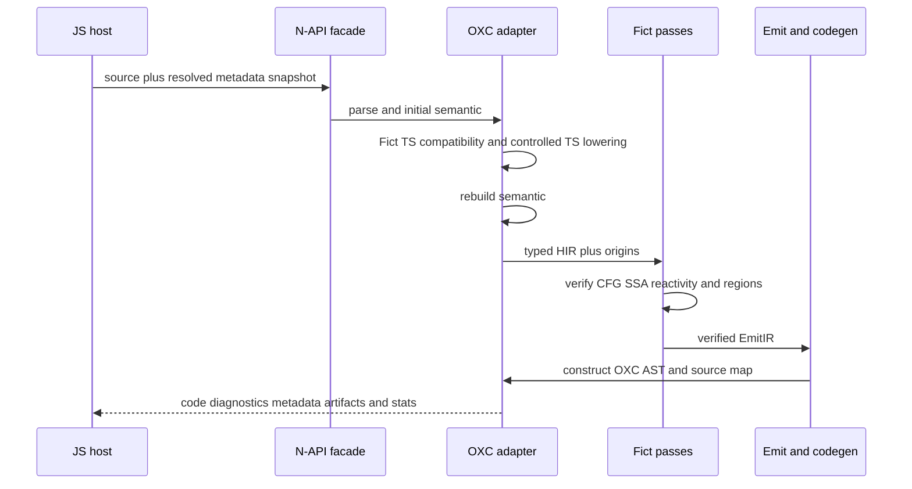

# Fict Rust Compiler Architecture

## Purpose

Fict will replace its Babel/TypeScript compiler implementation with an
OXC-native Rust compiler while preserving the language, runtime, diagnostics,
metadata, and strict-guarantee contracts already owned by the repository. The
migration exists to make compiler state explicit, remove Babel AST coupling,
improve deterministic performance, and give every compiler pass a verifiable
typed boundary.

The language contract remains in [Compiler Spec](../compiler-spec.md), the
reactivity classifications remain in the
[Guarantee Matrix](../reactivity-guarantee-matrix.md), and pass-specific
behavior remains in [Compiler Pass Invariants](../compiler-pass-invariants.md).
This document owns the target implementation boundaries and migration rules;
it does not redefine those semantics.

## Goals

- The parser, semantic model, Fict HIR, CFG, SSA, reactivity analysis,
  optimizer, EmitIR, code generation, diagnostics, and metadata analysis MUST
  execute in Rust on the default compiler path.
- OXC MUST own JavaScript/TypeScript syntax parsing, semantic facts, AST
  construction, and final code/source-map emission.
- Fict MUST own its language semantics and typed intermediate representations;
  an upstream AST implementation MUST NOT become the compiler core IR.
- Existing compiler/runtime ABI, metadata v1, diagnostic policy, and
  `strictGuarantee` behavior MUST remain compatible until changed through their
  existing contract processes.
- A build MUST use one compiler backend, build identifier, runtime ABI, and
  metadata schema. Per-file fallback is forbidden.

## Non-goals

- The migration does not change Fict's component execution or reactivity model.
- It does not make Preview resumability stable; Preview keeps its independent
  graduation policy.
- It does not move bundler-owned resolution, module identity, watch state, or
  package asset emission into the compiler core.
- It does not preserve arbitrary Babel sibling-plugin ordering after the Babel
  preset deprecation window.
- It does not add type checking. TypeScript syntax lowering remains distinct
  from a TypeScript program/checker.

## Ownership boundaries

What this shows: source-to-output computation is native Rust, while the host
retains the state that only a bundler can resolve authoritatively.

```mermaid
flowchart TB
  subgraph Host[JavaScript integration host]
    API[@fictjs/compiler facade]
    Graph[Bundler resolver and module graph]
    Cache[Disk cache and sidecars]
    Tools[Vite Webpack Playground VSCode]
  end

  subgraph Boundary[N-API boundary]
    Napi[fict-compiler-napi]
  end

  subgraph Native[Rust compiler]
    Orchestrator[fict-compiler]
    Oxc[fict-compiler-oxc]
    Hir[fict-hir]
    Reactive[fict-reactivity]
    Emit[fict-emit]
    Metadata[fict-metadata]
    Diagnostics[fict-diagnostics]
    Preview[fict-compiler-preview]
  end

  Tools --> API
  Graph --> API
  Cache --> API
  API --> Napi --> Orchestrator
  Orchestrator --> Oxc --> Hir --> Reactive --> Emit --> Oxc
  Orchestrator --> Metadata
  Orchestrator --> Diagnostics
  Preview -. optional .-> Emit
```

Verification: Cargo dependency checks MUST enforce the native arrows; API
boundary checks and integration tests MUST enforce the host/native split.

### Rust compiler owns

- request normalization that does not require external I/O;
- OXC parse diagnostics, comments, directives, semantic scopes, symbols, and
  references;
- Fict macro identity and placement validation;
- TypeScript syntax compatibility required by current Fict inputs;
- typed HIR, CFG, SSA/Phi, dependency, escape, shape, region, cycle, and
  structurization analysis;
- semantics-preserving optimizer passes;
- runtime-helper intent, DOM lowering, hook/props/event/list lowering, and
  optional structured Preview artifacts;
- deterministic diagnostics, module reactive metadata, generated code, and
  source maps.

### JavaScript integration host owns

- Vite/Webpack filters, virtual modules, query/fragment identity, alias and
  package resolution;
- module graph SCC convergence and resolved metadata snapshots;
- watch dependencies, HMR policy, cache files, sidecars, package metadata
  assets, and release integration;
- compatibility callbacks such as `onWarn` and application of compiler results
  to bundler APIs;
- loading the correct prebuilt native package for the current platform.

The Rust core MUST NOT read the filesystem, access the network, invoke a
JavaScript resolver callback, or retain OXC arena data across requests.

## Native dependency rules

- `fict-hir`, `fict-reactivity`, and `fict-emit` MUST NOT depend on OXC, N-API,
  Node, or bundler packages.
- `fict-compiler-oxc` is the only crate allowed to translate between OXC AST
  and Fict-owned IR.
- `fict-compiler-napi` performs schema conversion, scheduling, cancellation,
  and panic containment only; compiler semantics do not belong there.
- The Preview crate MUST remain optional and the stable compiler MUST NOT
  depend on it.
- Runtime helper names and metadata schema MUST have one machine-readable
  source of truth used by Rust and TypeScript verification.
- Visible iteration order MUST be deterministic across processes, platforms,
  and thread counts.

Verification: `cargo metadata`, workspace dependency tests, deterministic
fixture repetitions, and the existing API/Preview boundary checks are release
gates.

## Compilation lifecycle

What this shows: semantic information is rebuilt after syntax-changing TypeScript
passes, and no partially valid result reaches code generation.



Every syntax mutation that invalidates symbol/reference information MUST be
followed by semantic rebuilding. Parse, semantic, HIR, or verifier errors MUST
fail closed and MUST NOT emit partial runtime code.

## TypeScript compatibility

OXC's supported TypeScript lowering is used only where differential fixtures
prove equivalence. Fict owns a compatibility pass for repository contracts that
cannot be delegated safely, including merged/nested namespaces, mutable
namespace exports, CTS import-equals/export-assignment, decorators, source
extension rewriting, and query/fragment identity.

The compatibility pass MUST build an explicit namespace plan with declaration
segments, exported/internal binding ownership, mutable export synchronization,
metadata paths, source order, and origins. A verifier MUST reject an unresolved
namespace reference or write rather than silently emit a best-effort result.

Verification: the existing TypeScript/CTS/namespace fixtures run through both
backends during migration and become Rust conformance tests before legacy
removal.

## Compatibility and rollout

The JavaScript facade exposes build-level `legacy`, `rust`, and CI-only
`shadow` modes during migration. Shadow mode returns the legacy result while
recording structured differences in diagnostics, metadata, normalized IR,
helper sets, runtime behavior, and source-map probes. It MUST NOT transmit
source or absolute paths.

Rollout proceeds in this order:

1. ship an opt-in native backend with legacy as default;
2. enable shadow comparison in CI and representative applications;
3. switch Vite/Core builds to Rust after all semantic and release gates pass;
4. migrate Webpack and direct compiler consumers;
5. remove the legacy compiler and Babel production dependencies after the
   compatibility window;
6. graduate Preview separately.

A rollback changes the backend for the whole build, invalidates compiler and
metadata caches, and performs a full rebuild. Rust-generated sidecars or
Preview artifacts MUST NOT be reused by a legacy rebuild.

## Performance and resource policy

Correctness gates take precedence over throughput. Benchmarks MUST distinguish
addon load, warm per-file latency, large-project throughput, source maps,
metadata SCCs, peak RSS, output size, and native package size. Published claims
must come from paired/interleaved samples and retain raw artifacts.

The native compiler MUST bound AST depth, node/block/region counts, and
fixed-point iterations. Each request owns its OXC allocator; AST and semantic
references MUST NOT enter global caches. Parallel requests MUST produce the
same observable result as sequential requests.

Verification: compiler differential benchmarks, HIR/output guardrails, repeated
thread-count comparisons, fuzz targets, and clean native-package installation
are required before default switching.

## Failure modes and monitoring

The build MUST stop or roll back the backend on:

- a Guaranteed-row behavior difference;
- a production strict-guarantee downgrade;
- runtime helper or metadata ABI mismatch;
- false cache hits, source-map probe failures, native panic/crash, or platform
  loader failure;
- unapproved p95, RSS, output-size, or install-size regression.

Compiler statistics may record stage duration, node/block/region/helper counts,
cache disposition, native platform, and internal-error count. Source code,
absolute paths, and project identity MUST remain local unless a separate
telemetry policy is explicitly approved.

## Human review requirements

Reviewers MUST examine:

- language/strict-guarantee equivalence rather than snapshot similarity alone;
- TypeScript namespace and CTS ownership;
- runtime-helper and metadata schema compatibility;
- source-map origins for generated getters, bindings, and handlers;
- query/fragment/public module identity;
- N-API thread affinity, cancellation, and panic boundaries;
- cache false-hit risk and deterministic iteration;
- native platform coverage and atomic package release;
- Babel preset deprecation and Preview isolation.

## Verification

Existing contract evidence:

```bash
pnpm -C packages/compiler test
pnpm guardrails:hir
pnpm bench:optimizer:guard
pnpm test:api-boundaries
pnpm test:preview-boundaries
pnpm release:compiler:verify
```

Native implementation evidence, required as the corresponding milestones land:

```bash
cargo fmt --check
cargo clippy --workspace --all-targets --all-features -- -D warnings
cargo test --workspace
pnpm test:compiler:differential
pnpm test:compiler:native-packages
pnpm release:verify
```

Commands not yet present are rollout gates, not evidence of current
implementation. The architecture decision can be accepted independently of
claiming that the migration is complete.

# Citations

- [OXC Parser](https://oxc.rs/docs/guide/usage/parser.html) — JavaScript,
  TypeScript, JSX, and TSX parsing boundary.
- [OXC Transformer](https://oxc.rs/docs/guide/usage/transformer) — transformer
  ordering and controlled TypeScript/JSX options.
- [React Compiler Rust port](https://github.com/facebook/react/pull/36173) —
  comparable HIR/CFG/SSA pass migration and native integration trade-offs.
- [NAPI-RS release model](https://napi.rs/docs/deep-dive/release) — prebuilt
  per-platform npm package structure.
