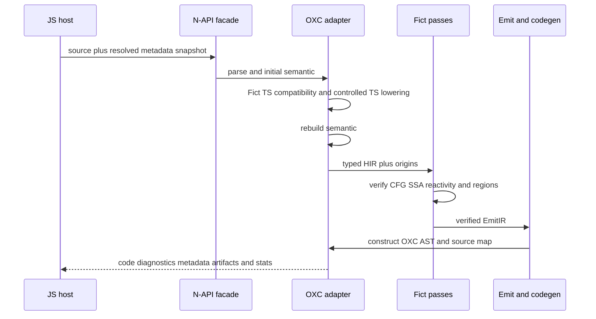

# Fict Rust Compiler Architecture

## Purpose

Fict 0.31 uses an OXC-native Rust compiler for the language, runtime diagnostic,
metadata, and strict-guarantee contracts owned by the repository. The completed
migration made compiler state explicit, removed Babel AST coupling, improved
deterministic performance, and gave every compiler pass a verifiable typed
boundary.

The language contract remains in [Compiler Spec](../compiler-spec.md), the
reactivity classifications remain in the
[Guarantee Matrix](../reactivity-guarantee-matrix.md), and pass-specific
behavior remains in [Compiler Pass Invariants](../compiler-pass-invariants.md).
This document owns the target implementation boundaries and migration rules;
it does not redefine those semantics.

## Goals

- The parser, semantic model, Fict HIR, CFG, SSA, reactivity analysis,
  optimizer, EmitIR, code generation, diagnostics, and metadata analysis MUST
  execute in Rust on the default compiler path.
- OXC MUST own JavaScript/TypeScript syntax parsing, semantic facts, AST
  construction, and final code/source-map emission.
- Fict MUST own its language semantics and typed intermediate representations;
  an upstream AST implementation MUST NOT become the compiler core IR.
- Existing compiler/runtime ABI, metadata v1, diagnostic policy, and
  `strictGuarantee` behavior MUST remain compatible until changed through their
  existing contract processes.
- A build MUST use one compiler build identifier, runtime ABI, and metadata
  schema. Per-file fallback is forbidden.
- Promotion and release binaries MUST embed the exact Git source revision; all
  rollout evidence MUST report that same revision before a candidate can be
  sealed. Local builds MAY omit it but cannot become promotion evidence.

## Non-goals

- The migration does not change Fict's component execution or reactivity model.
- It does not make Preview resumability stable; Preview keeps its independent
  graduation policy.
- It does not move bundler-owned resolution, module identity, watch state, or
  package asset emission into the compiler core.
- It does not preserve arbitrary Babel sibling-plugin ordering after the Babel
  preset deprecation window.
- It does not add type checking. TypeScript syntax lowering remains distinct
  from a TypeScript program/checker.

## Ownership boundaries

What this shows: source-to-output computation is native Rust, while the host
retains the state that only a bundler can resolve authoritatively.

```mermaid
flowchart TB
  subgraph Host[JavaScript integration host]
    API[@fictjs/compiler facade]
    Graph[Bundler resolver and module graph]
    Cache[Bundler cache and package metadata assets]
    Tools[Vite Webpack Playground VSCode]
  end

  subgraph Boundary[N-API boundary]
    Napi[fict-compiler-napi]
  end

  subgraph Native[Rust compiler]
    Orchestrator[fict-compiler]
    Oxc[fict-compiler-oxc]
    Hir[fict-hir]
    Reactive[fict-reactivity]
    Emit[fict-emit]
    Metadata[fict-metadata]
    Diagnostics[fict-diagnostics]
    Preview[fict-compiler-preview]
  end

  Tools --> API
  Graph --> API
  Cache --> API
  API --> Napi --> Orchestrator
  Orchestrator --> Oxc --> Hir --> Reactive --> Emit --> Oxc
  Orchestrator --> Metadata
  Orchestrator --> Diagnostics
  Preview -. optional .-> Emit
```

Verification: Cargo dependency checks MUST enforce the native arrows; API
boundary checks and integration tests MUST enforce the host/native split.

### Rust compiler owns

- request normalization that does not require external I/O;
- OXC parse diagnostics, comments, directives, semantic scopes, symbols, and
  references;
- Fict macro identity and placement validation;
- TypeScript syntax compatibility required by current Fict inputs;
- typed HIR, CFG, SSA/Phi, dependency, escape, shape, region, cycle, and
  structurization analysis;
- semantics-preserving optimizer passes;
- runtime-helper intent, DOM lowering, hook/props/event/list lowering, and
  optional structured Preview artifacts;
- deterministic diagnostics, module reactive metadata, generated code, and
  source maps.

### JavaScript integration host owns

- Vite/Webpack filters, virtual modules, query/fragment identity, alias and
  package resolution;
- module graph SCC convergence and resolved metadata snapshots;
- watch dependencies, HMR policy, bundler cache files, package metadata assets,
  and release integration;
- compatibility callbacks such as `onWarn` and application of compiler results
  to bundler APIs;
- loading the correct prebuilt native package for the current platform.

The Rust core MUST NOT read the filesystem, access the network, invoke a
JavaScript resolver callback, or retain OXC arena data across requests.

## Native dependency rules

- `fict-hir`, `fict-reactivity`, and `fict-emit` MUST NOT depend on OXC, N-API,
  Node, or bundler packages.
- `fict-compiler-oxc` is the only crate allowed to translate between OXC AST
  and Fict-owned IR.
- `fict-compiler-napi` performs schema conversion, scheduling, cancellation,
  and panic containment only; compiler semantics do not belong there.
- The Preview crate MUST remain optional and the stable compiler MUST NOT
  depend on it.
- Runtime helper names and metadata schema MUST have one machine-readable
  source of truth used by Rust and TypeScript verification.
- Visible iteration order MUST be deterministic across processes, platforms,
  and thread counts.

Verification: `cargo metadata`, workspace dependency tests, deterministic
fixture repetitions, the rollout candidate source-revision contract, and the
existing API/Preview boundary checks are release gates.

## Compilation lifecycle

What this shows: semantic information is rebuilt after syntax-changing TypeScript
passes, and no partially valid result reaches code generation.



Every syntax mutation that invalidates symbol/reference information MUST be
followed by semantic rebuilding. Parse, semantic, HIR, or verifier errors MUST
fail closed and MUST NOT emit partial runtime code.

## Source map contract and evidence

The request boundary accepts a standard non-indexed Source Map v3. Indexed maps
with `sections` MUST be flattened by the integration host before they are sent
as `inputSourceMap`; the compiler rejects that field rather than ignoring an
uncomposed section. Multi-source maps also require a unique intermediate
identity in `inputSourceMap.file`.

The cross-implementation oracle is intentionally a reviewed sample: three
frozen Babel 0.28 maps and live Rust maps are compared at 23 authored token
positions. Ten positions are exact parity and thirteen are reviewed Rust
precision improvements. Eight native source-map probe suites cover additional
lowering surfaces, including nested keyed lists, try/catch/finally writes,
erased TypeScript class fields, multiline JSX, CommonJS preludes, and UTF-16
columns. Those native-only probes broaden the contract but are not additional
Babel equivalence claims, and neither suite proves exhaustive token-level
source-map equivalence.

## TypeScript compatibility

OXC's supported TypeScript lowering is used only where differential fixtures
prove equivalence. Fict owns a compatibility pass for repository contracts that
cannot be delegated safely, including merged/nested namespaces, mutable
namespace exports, CTS import-equals/export-assignment, decorators, source
extension rewriting, and query/fragment identity.

Legacy TypeScript parameter decorators are lowered through OXC's explicit
legacy mode. Standard decorators fail closed with
`FICT-TS-DECORATOR-STANDARD` until a target-compatible lowering is connected;
the compiler MUST NOT return success while preserving raw decorator syntax in
JavaScript output.

The compatibility pass MUST build an explicit namespace plan with declaration
segments, exported/internal binding ownership, mutable export synchronization,
metadata paths, source order, and origins. A verifier MUST reject an unresolved
namespace reference or write rather than silently emit a best-effort result.

Verification: TypeScript/CTS/namespace fixtures are Rust conformance tests and
the native fuzz target exercises the same request pipeline.

## Compatibility and release

The compatibility sequence is complete: `0.29.0` introduced the published Rust
default, `0.30.0` completed the subsequent stable minor, `0.30.1` was the final
legacy/preset release, and `0.31.0` removes the second implementation. The 0.31
facade has no backend selector, shadow path, Babel dependency, or `./legacy`
export.

The coordinated scope change is defined by
[ADR-0003](../adr/0003-retire-babel-preset.md). Preview graduation remains a
separate decision.

### Frozen regression evidence

Removing the executable Babel backend does not remove its reviewed behavior
evidence. The machine-readable
[compatibility evidence scope](../../scripts/fixtures/compiler_compatibility_evidence_scope.json)
keeps codegen regression, request-contract, and executable semantic evidence
separate and records what each asset does and does not prove. The repository
retains a Rust-only frozen codegen corpus:

- 1,892 unique audit-baseline source-and-option inputs plus 58
  source-grounded `strictGuarantee: true` variants, for 1,950 compiled requests;
- Babel status, diagnostic codes, and output hashes regenerated with the exact
  0.28.0 compiler artifact from revision `b99ff5b185e3eed701e2d4f3521832dac67c979f`;
- expected Rust status, structured diagnostic class, and output hashes generated
  by one reviewed native build, plus an explicit policy for every reviewed
  audited-Babel-to-Rust status deviation.

The strict variants are not inferred from the normalized audit rows. The
[request-policy manifest](../../scripts/fixtures/compiler_corpus_request_policy.json)
parses all 107 original 0.28.0 compiler test files with the pinned Babel parser,
matches every one of the 1,892 extracted calls, and records 46 explicit strict
requests plus 12 calls whose compiler-default helper enabled strict mode. Corpus
generation fails instead of assigning a deviation policy if any of those 58
requests has different Babel and Rust success/error status.

The 73 source files containing at least one audit row are not described as 73
covered files. The source-grounded
[legacy assertion inventory](../../scripts/fixtures/legacy_0_28_compiler_assertion_inventory.json)
records all 2,657 static `it`/`test` declaration sites and 6,350 static `expect`
calls in the 107-file suite. It links each test callback to its exact corpus
base IDs, records 214 additional calls through the same compiler-helper
bindings that have no audit row, and marks 132 compiler callsites found under
parameterized execution. The report therefore distinguishes complete-looking
corpus context, partial context, unrepresented compiler context, and tests with
no direct compiler call. A corpus association means only that the callback
contains a frozen request; it does not replay the old assertion or expand every
runtime instance of an `it.each` or lexical loop.

This distinction catches omissions hidden by file-level counting. For example,
the two-case strict `renderHook`/`utils.renderHook` loop in the old semantic
validation suite is explicitly recorded with two assertions and an
unrepresented `transform` call, while current member, optional-member, global,
alias, and shadowing behavior is covered by native frontend and runtime tests.
The inventory is pinned to the same legacy source-tree and extraction-input
digests as the corpus, so changing the old suite or audit requires a reviewed
regeneration rather than silently preserving the 73-file headline.

The 214 previously unrepresented compiler callsites now have a separate
[runtime callsite replay](../../crates/fict-compiler/tests/legacy_unrepresented_callsite_replay.json).
Its generator runs the 29 affected legacy test files unchanged: 147 suites and
1,917 tests pass while an in-memory probe records 2,327 compiler
invocations. Exact stack frames associate 1,444 runtime executions with 212 of
the static callsites. The remaining two sites are explicit reviews: one is an
unused helper body, and one is rejected by the Babel parser before the compiler
visitor can run.

Those executions deduplicate to 1,222 native requests while retaining
serializable compiler policy, CommonJS host context, warnings, and captured
module metadata. Random temporary file URLs are normalized before fixture
identity is computed. If the legacy invocation supplied an authoritative
metadata Map or resolver, every unresolved static request receives an explicit
`missing` snapshot; host callbacks and filesystem behavior do not cross into
the native request.

CI compiles every replay fixture twice and checks status, structured diagnostic
summary, output hash, and a deterministic full-result hash with timing and build
identity removed. A Node guard independently checks callsite/fixture linkage,
the two zero-invocation reviews, metadata snapshots, and all policy rows. The
only status differences are five already-reviewed migration policies: three
Babel-success/Rust-error fail-closed cases and two Babel-error/Rust-success
cases. This is complete compiler-invocation regression coverage for the 214
sites; it does not compare generated Babel output or prove that every legacy
assertion has a semantically equivalent native assertion.

The 34 files with no audit row use a separate
[legacy domain ledger](../../scripts/fixtures/legacy_0_28_test_domain_coverage.json).
Its schema declares the strength of every replacement claim instead of treating
all marker matches alike: 10 domains have executable runtime behavior, four
assert emitted output or diagnostics, four execute migrated host contracts,
nine assert structural IR/analysis invariants, one compiles the public type
contract, three execute tooling or release gates, and three are documented
intentional removals. Structural and gate evidence is explicitly not presented
as runtime equivalence. Each of the 34 decisions is digest-bound to its exact
legacy inventory record, covering all 467 test declarations and 1,009 static
assertions, so a marker can no longer stand in for an unreviewed legacy surface.
The old fine-grained DOM override-key helper is classified as structural
replacement: typed `LocalId`/`SsaName` identities and HIR object-key invariants
replace it, without claiming that a broad DOM runtime test is equivalent to that
retired internal mechanism.

The directive domain is now behavioral evidence, not parse/flag evidence. It
executes compiler-disable precedence, module and nested no-memo lowering,
function-pure DCE/CSE with mutation and coercion barriers, and exact removal of
`use no memo`/`use pure` while preserving authored directives. The optimizer
domain likewise combines internal fixed-point/SSA invariants with executable
optimization on/off and `use pure` runtime results.

Status review is not used as a proxy for diagnostic compatibility. The
[diagnostic deviation review](../../scripts/fixtures/compiler_diagnostic_deviation_reviews.json)
binds the exact ordered Babel code/severity sequence and Rust
code/severity/guarantee-class sequence for every differing fixture, including
same-status differences. Its policies separately identify structured Rust
rejection diagnostics, severity changes, warning additions, warning removals,
and warning-set replacements. Corpus regeneration fails on any unreviewed
diagnostic delta and can emit a candidate review for inspection without silently
accepting it.

The corpus records these as separate `sourceSuite*`, `babelAudit*`, and
`rustAudit*` provenance fields. Its schema binds the 0.28.0 compiler source
digest, built artifact digest, frozen lockfile, package-manager identity, Babel
dependency versions, original virtual audit filename, and extraction-input
digest. It also binds the request-policy manifest and the complete legacy test
source-tree digest. The extraction input supplies the 1,892 baseline
source/request rows; the policy manifest restores the 58 strict request
dimensions that normalization removed. The extraction input's
embedded Babel outcomes are not copied into the corpus. Instead, every freshly
executed 0.28.0 status, diagnostic-code list, and code hash must independently
match that audit record before generation can succeed.

The Rust integration test compiles every input twice, strips timing noise, and
checks deterministic results against those Rust-owned goldens. This proves
determinism and detects native output or diagnostic drift; because the expected
values were produced by Rust, it does not independently prove Babel semantic
equivalence. The 13 frontend outcomes, seven normalized analysis snapshots,
and native runtime tests are separate evidence rather than outputs of this
corpus.

The guardrail verifies corpus size, provenance, status and diagnostic deviation
reviews, test wiring, and retained native runtime cases so deleting or changing
the regression evidence cannot silently leave CI green.

The distinct Babel 0.28 semantic oracle freezes compiled CommonJS output,
structured warnings, and observable results for 24 runtime probes. Its
provenance binds the exact 0.28.0 source-tree digest, built artifact digest,
frozen lockfile and package-manager identity, Babel dependency versions, and
input digest. CI executes that frozen Babel code and current Rust output through
the same isolated reactive harness, then compares both diagnostics and
observable values. The one reviewed diagnostic deviation removes two spurious
hook-member escape warnings and is explicit in the input manifest.

This independent oracle covers state, derived invalidation, effects, projected
mutation, destructuring, hooks, loops, try/finally, explicit memos, optional
dependencies, update-expression order, numeric edge cases, runtime-package
imports, compiler directives and suppression, member reactive scopes, VNode
events, async and generator order, class fields, and TypeScript namespace/enum
lowering. It is a real semantic gate for those domains, not a claim of full
language equivalence.

Tooling behavior has its own four-fixture Babel 0.28 oracle instead of being
inferred from the request-shape test. It freezes `fictExplain` and
`analyzeFictFile` artifacts, then runs live native `transformSync` and
`analyzeSync` requests. Source event roles and one-based UTF-16 positions match
exactly. Runtime helper names are normalized to reviewed capabilities because
the emitters use different private helper ABIs. Named component boundaries
must match; legacy trace marker kinds remain a subset with every native
structured-analysis addition declared in the input manifest. Region IDs and
layout remain emitter-specific, so CI compares aggregate dependencies,
declarations, control-flow ownership, and reactive writes. Diagnostic coverage
and the two finer native control spans are explicit dispositions. This gate
does not claim identical messages, helper names, trace labels, or region IDs.

SSR is a separate executable oracle instead of an inference from client DOM
tests. Three ESM fixtures run frozen 0.28.0 Babel output and live Rust output
through the same current `@fictjs/ssr` and runtime builds. They compare
`renderToString` structure, strict hydration claims that retain existing nodes,
eager click and exported-state updates, snapshot creation, component resume,
and two resumable click updates. The harness deliberately canonicalizes
adjacent text-node segmentation and excludes compiler-private QRL/scope values
while retaining public elements, attributes, namespaces, form state, hydration
issues, node identity, and observable updates. This proves the reviewed
compiler-output behavior; it does not prove legacy-runtime ABI, streaming,
Suspense, or every legacy SSR fixture.

Source-map compatibility is also a cross-implementation oracle rather than an
inference from map shape. Three fixtures retain the frozen Babel maps and trace
23 reviewed generated tokens through reactivity, props, events, control flow,
keyed lists, effects, async/await, JSX bindings, Unicode, TypeScript/CommonJS
rewrites, and generated preludes. CI replays each frozen Babel trace and traces
the corresponding live Rust token to its authored line and UTF-16 column. Ten
positions are exact parity; thirteen are explicit, reviewed Rust precision
improvements where Babel pointed at a coarser statement or JSX boundary. The
comparison deliberately does not require identical generated positions or
claim exhaustive token-map equivalence, because the two emitters have different
layouts.

The machine-readable [E-07 semantic coverage
matrix](../../scripts/fixtures/compiler_semantic_coverage_matrix.json) binds the
remaining reviewed categories to their actual evidence strength. Browser
DOM/delegation, reviewed CommonJS host semantics, and all 10 remaining classified Rust
acceptances use native runtime evidence; module identity uses the request
contract; rejected component roles and decorators use diagnostic contracts;
and complex lowerings combine sampled Babel/Rust source-position traces with
deeper native probes. Those native-only or rejection contracts are not
presented as cross-implementation runtime equivalence.

A second full-request matrix prevents the semantic probes from collapsing every
input to `.tsx`/CommonJS. Eighteen of its 30 reviewed requests freeze output from
the exact 0.28.0 Babel preset build, including its own source and artifact
digests. The matrix covers `.ts`, `.tsx`, `.js`, `.jsx`, `.mts`, `.mjs`, `.cts`,
and `.cjs`; explicit language and module-kind overrides; strict-default and
opt-out behavior; composed input maps; explanations; physical, graph, and public
module identities; and resolved/incomplete metadata snapshots.

The matrix compares structural behavior instead of emitter text. It records two
intentional status differences rather than hiding them: Rust accepts CTS
top-level returns that Babel rejected, while JSX in a `.js` file now requires a
`.jsx` filename or explicit `language: "jsx"`. Source maps compare normalized
authored identities because Babel resolves `sourceRoot` into `sources`, whereas
the native response preserves the original structured fields. The twelve
native-only host-protocol rows are explicitly marked and are not presented as
Babel equivalence evidence.

Authored multiline JSX text is one deliberate syntax-level difference: the
native frontend applies standard JSX whitespace normalization before lowering,
where Babel 0.28 preserved raw line terminators and indentation. This does not
change the reactivity model, but it can change rendered text. The exact contract
and source migration are recorded in the compiler spec and migration guide.

Run the focused gate with:

```bash
pnpm test:compiler:compatibility-corpus
pnpm test:compiler:request-matrix
```

After 0.31, rollback means restoring a complete 0.30.1 application release and
its lockfile. Compiler/runtime packages, generated output, package metadata,
bundler caches, and Preview artifacts MUST NOT be mixed across that boundary.

## Performance and resource policy

Correctness gates take precedence over throughput. Benchmarks MUST distinguish
addon load, warm per-file latency, large-project throughput, source maps,
metadata SCCs, peak RSS, output size, and native package size. The versioned
compiler budget owns both compressed tarball and npm unpacked-size ceilings;
native bundle creation and verification MUST independently evaluate those
ceilings and retain the result in build evidence. Published claims must come
from paired/interleaved samples and retain raw artifacts.

The native compiler MUST bound AST depth, node/block/region counts, and
fixed-point iterations. Each request owns its OXC allocator; AST and semantic
references MUST NOT enter global caches. Parallel requests MUST produce the
same observable result as sequential requests.

Verification: Rust crate/file budgets, repeated thread-count comparisons, fuzz
targets, native bundle size evidence, and clean native-package installation are
required for release. Budget
values live in `.github/compiler-backend-budget.json`; changing a ceiling
requires the same maintainer review as changing a performance or RSS budget.
The standalone fuzz workspace owns an independent lockfile; CI MUST validate it
with Cargo's locked metadata mode before building or running fuzz targets so an
OXC pin change cannot silently resolve a different fuzz dependency graph.
CI and release verification MUST also audit both the root and fuzz lockfiles
with the pinned `cargo-audit` version and `--deny warnings`. Advisory ignores,
stale-database acceptance, and skipping the independent fuzz lockfile are not
valid ways to make a candidate pass.

The executable M7 promotion policy, candidate chain, privacy-safe allowlist,
performance/RSS budget, and human approval are owned by the
[Rust compiler rollout](../features/rust-compiler-rollout/rollout.md). Operational
recovery is owned by the
[compiler backend rollback runbook](../operations/runbooks/compiler-backend-rollback.md).

## Failure modes and monitoring

The build MUST stop or roll back the backend on:

- a Guaranteed-row behavior difference;
- a production strict-guarantee downgrade;
- runtime helper or metadata ABI mismatch;
- false cache hits, source-map probe failures, native panic/crash, or platform
  loader failure;
- unapproved p95, RSS, output-size, or install-size regression.

Compiler statistics may record stage duration, node/block/region/helper counts,
cache disposition, native platform, and internal-error count. Source code,
absolute paths, and project identity MUST remain local unless a separate
telemetry policy is explicitly approved.

## Human review requirements

Reviewers MUST examine:

- language/strict-guarantee equivalence rather than snapshot similarity alone;
- TypeScript namespace and CTS ownership;
- runtime-helper and metadata schema compatibility;
- source-map origins for generated getters, bindings, and handlers;
- query/fragment/public module identity;
- N-API thread affinity, cancellation, and panic boundaries;
- cache false-hit risk and deterministic iteration;
- native platform coverage and atomic package release;
- 0.30.1-only rollback isolation and Preview isolation.

The release-blocking target and Node runtime requirements are fixed by
[ADR-0002](../adr/0002-native-compiler-support-matrix.md). Platform package
availability is part of compiler correctness, not a best-effort distribution
concern.

## Verification

Existing contract evidence:

```bash
pnpm -C packages/compiler test
pnpm guardrails:compiler-complexity
pnpm guardrails:rust-crates
pnpm test:api-boundaries
pnpm test:preview-boundaries
pnpm release:compiler:verify
```

Native implementation evidence, required as the corresponding milestones land:

```bash
pnpm verify:rust-workspace
pnpm security:audit:rust
pnpm test:compiler:native-packages
pnpm release:verify
```

These commands are live gates. Passing the native packaging commands proves the
distribution boundary only; publication still requires the complete release
workflow, native certification, and rollout-state approval.

# Citations

- [OXC Parser](https://oxc.rs/docs/guide/usage/parser.html) — JavaScript,
  TypeScript, JSX, and TSX parsing boundary.
- [OXC Transformer](https://oxc.rs/docs/guide/usage/transformer) — transformer
  ordering and controlled TypeScript/JSX options.
- [React Compiler Rust port](https://github.com/facebook/react/pull/36173) —
  comparable HIR/CFG/SSA pass migration and native integration trade-offs.
- [NAPI-RS release model](https://napi.rs/docs/deep-dive/release) — prebuilt
  per-platform npm package structure.
