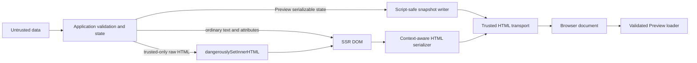

# Security Boundaries and 1.0 Review

## Purpose and disposition

This document records the security review of five framework attack surfaces:
HTML serialization, Preview resume snapshots, CSP and Trusted Types, prototype
and Proxy behavior, and concurrent SSR isolation. It defines the trust
boundaries that future changes MUST preserve and maps every framework-owned rule
to executable evidence.

Within the threat model below, the review has no unresolved high- or
medium-severity implementation finding. Human security sign-off is still
`NEEDS_REVIEW`, so this document remains proposed. The review does not graduate
resumability or partial prerendering: those surfaces remain Preview and do not
block the Core 1.0 release.

## Threat model

The framework assumes an attacker may control ordinary application data,
including text, attribute values, object keys such as `__proto__`, and strings
stored in a resume snapshot. The framework MUST keep those values from changing
the HTML parser context, mutating JavaScript prototypes, or crossing SSR request
boundaries.

The following are trusted application boundaries, not sandboxes:

- Component code, snapshot migration functions, getters, and Proxy traps are
  application JavaScript. Executing them is equivalent to executing other
  application code.
- `dangerouslySetInnerHTML` is an explicit raw-HTML sink. Its value MUST be
  sanitized or otherwise proven safe before it reaches Fict.
- The server HTML, module manifest, QRL attributes, and runtime assets MUST come
  from one trusted, atomically deployed build over an integrity-protected
  transport.
- CSP, URL-scheme policy, response-size limits, authentication, authorization,
  and secret classification remain deployment or application responsibilities.

What this shows: untrusted data may enter application state, but only the normal
serializer and validated snapshot decoder are framework security boundaries.
Raw HTML and executable application objects remain explicitly trusted paths.



Verification: the focused commands in [Verification](#verification) exercise
each boundary and the failure paths in the findings table.

## Findings

| ID             | Severity | Disposition | Framework rule and evidence                                                                                                                                                                                                                                                                                                                                                                                                 |
| -------------- | -------- | ----------- | --------------------------------------------------------------------------------------------------------------------------------------------------------------------------------------------------------------------------------------------------------------------------------------------------------------------------------------------------------------------------------------------------------------------------- |
| `SEC-HTML-01`  | High     | Controlled  | Ordinary values MUST NOT escape text, attribute, raw-text, RCDATA, comment, doctype, or element-name contexts. The custom serializer rejects parser-ambiguous nodes and neutralizes split end tags. Verified by `packages/ssr/test/html-serializer.test.ts`, the DOM-name tests in `packages/ssr/test/index.test.ts`, and deferred-patch cases in `packages/ssr/test/streaming.test.ts`.                                    |
| `SEC-SNAP-01`  | High     | Controlled  | Snapshot JSON MUST NOT break out of its script element. Initial and incremental writers escape parser-sensitive characters; malformed and unsupported payloads fail closed. Verified by snapshot breakout and incremental snapshot tests in the SSR suite plus parse, shape, version, and migration tests in `packages/runtime/test/loader.test.ts`.                                                                        |
| `SEC-SNAP-02`  | High     | Controlled  | Parsed keys such as `__proto__` and `constructor` MUST remain own data properties and MUST NOT mutate object prototypes. Marker shapes, reference paths, and source prototypes are validated. Verified by `packages/runtime/test/serialize.test.ts` and descriptor-mutated streamed-state cases in `packages/runtime/test/loader.test.ts`.                                                                                  |
| `SEC-SSR-01`   | High     | Fixed       | A render using legacy process DOM globals MUST NOT overlap another such render, including through another loaded package copy. Installation now acquires a process-wide lease, rejects overlap, restores exact property descriptors without invoking accessors, and rolls back a partial install. Verified by `packages/ssr/test/globals.test.ts` and the overlapping-stream case in `packages/ssr/test/streaming.test.ts`. |
| `SEC-CSP-01`   | Medium   | Fixed       | External observer streaming with container/body snapshots MUST emit no executable inline patch or snapshot script. Incremental `snapshotTarget: 'head'` output needs an executable mover, so external shell mode now rejects that configuration unless a non-empty nonce is supplied. Verified by strict-CSP tests in `packages/ssr/test/streaming.test.ts`.                                                                |
| `SEC-PROXY-01` | Medium   | Fixed       | Compatibility-global capture MUST NOT execute getters/setters, and rollback failure through a hostile descriptor/Proxy MUST fail closed instead of permitting another install on a poisoned target. Verified by `packages/ssr/test/globals.test.ts`.                                                                                                                                                                        |
| `SEC-TT-01`    | Medium   | Controlled  | The observer patch runtime MUST use DOM node movement and MUST NOT introduce `innerHTML`, `insertAdjacentHTML`, `eval`, or `Function` sinks. Verified by the Trusted Types sink regression in `packages/ssr/test/streaming.test.ts`.                                                                                                                                                                                        |
| `SEC-ISO-01`   | High     | Controlled  | Normal SSR state, resources, stream hooks, identifiers, and manifests MUST remain request-local across async work. Verified by `packages/runtime/test/ssr-session.test.ts`, `packages/ssr/test/resource-cache.test.ts`, and concurrent stream/snapshot tests in `packages/ssr/test/streaming.test.ts`.                                                                                                                      |

`Fixed` means this review changed behavior. `Controlled` means the required
control and regression evidence already existed and was re-audited.

## Boundary rules

### HTML serialization

- Final SSR output MUST pass through the context-aware serializer; a permissive
  server DOM's `outerHTML` is not a security boundary.
- Dynamic element and attribute names MUST be validated before output and again
  at final serialization when a pre-created DOM can bypass runtime validation.
- Text and attributes MUST be escaped for their parser contexts. Raw-text and
  RCDATA terminators MUST remain inert even when split across adjacent DOM text
  nodes.
- Comments, doctypes, processing instructions, `<plaintext>`, and parser-sensitive
  resumable host placements MUST either serialize unambiguously or be rejected.
- Fict MUST NOT claim that escaping sanitizes raw HTML or unsafe URL schemes.
  `dangerouslySetInnerHTML` and application-selected URLs require an
  application-owned policy.

Verification: `packages/ssr/test/html-serializer.test.ts`,
`packages/ssr/test/index.test.ts`, and the raw-text/invalid-name deferred cases
in `packages/ssr/test/streaming.test.ts`.

### Resume snapshots

- Snapshot data is client-visible by design and MUST NOT contain secrets,
  credentials, or private data that the response recipient may not read.
- Embedded JSON MUST remain non-executable and script-safe. Parsed object keys
  MUST be installed as data properties so `__proto__` cannot invoke an inherited
  setter.
- Unknown schema versions, malformed shapes, invalid markers, missing
  references, and failed migrations MUST be rejected rather than guessed.
- Migrations are explicit application code. Fict MUST NOT run heuristic legacy
  format detection or present a migration/Proxy/getter as untrusted-code
  isolation.
- Preview currently has no built-in snapshot byte or nesting quota. Applications
  MUST enforce response limits and the route budgets in
  [SSR / Resume Stability Contract](../ssr-resume-stability-contract.md). Adding
  a runtime quota would be a separate Preview API decision, not a Core 1.0
  security blocker.

Verification: `packages/runtime/test/serialize.test.ts`,
`packages/runtime/test/loader.test.ts`, `packages/runtime/test/resume-lifecycle.test.ts`,
and the initial/incremental snapshot tests in the SSR suite.

### CSP and Trusted Types

- Nonces MUST be HTML-escaped on every generated script tag and
  JavaScript-string-escaped when copied by the Preview head-snapshot mover.
- Strict CSP routes without inline-script permission SHOULD use the published
  external runtime, observer patches, and `snapshotTarget: 'container'` or
  `'body'`.
- `snapshotTarget: 'head'` in shell streaming requires a small executable mover
  for incremental snapshots. With an external runtime, Fict MUST reject that
  combination unless `scriptNonce` is non-empty.
- Trusted Types deployments SHOULD use external observer mode. Fict does not
  create a browser policy; a host policy, when required, owns the complete HTML
  response.
- CSP is defense in depth and MUST NOT be described as HTML sanitization.

Verification: nonce, external-runtime, observer, head-target, and Trusted Types
tests in `packages/ssr/test/streaming.test.ts`; deployment configuration remains
a manual review item in [SSR Deployment Guide](../ssr-deployment.md).

### Prototype and Proxy behavior

- Snapshot decoding and props-rest copying MUST preserve hostile-looking keys as
  own data without changing the output prototype.
- Unsupported source prototypes and malformed serialization markers MUST fail
  closed.
- Store and props proxies MUST obey JavaScript invariants for frozen,
  non-configurable, class, platform, and null-prototype objects.
- Reflection-only framework paths SHOULD avoid invoking property accessors.
  Operations that intentionally read application state may execute its getters
  or Proxy traps; those objects are trusted application code, not hostile input.
- A failed process-global compatibility installation MUST restore all earlier
  descriptors. If a hostile Proxy prevents rollback, the target MUST remain
  locked against later installations.

Verification: `packages/runtime/test/serialize.test.ts`,
`packages/runtime/test/store.test.ts`, `packages/runtime/test/props-proxy.test.ts`,
and `packages/ssr/test/globals.test.ts`.

### Concurrent SSR isolation

- Supported rendering MUST keep DOM access, reactive scope state, resource
  caches, stream hooks, and manifests local to the active SSR session.
- Node async continuations MUST use the installed async session carrier. Edge
  streaming callbacks MUST explicitly re-enter their owning session; the plain
  fallback stack fails closed across an unsupported `await`.
- SSR MUST leave process DOM globals untouched by default.
- `exposeGlobals: true` is a legacy compatibility lease. A second nested or
  overlapping lease, including one from another package copy, MUST fail without
  modifying the active render, and `renderToDocument()` holds its lease until
  `dispose()`.

Verification: `packages/runtime/test/ssr-session.test.ts`,
`packages/ssr/test/resource-cache.test.ts`, `packages/ssr/test/globals.test.ts`,
and concurrent/cleanup cases in `packages/ssr/test/streaming.test.ts`.

## Explicit non-goals and residual responsibilities

These are not unresolved framework vulnerabilities within the stated threat
model:

| Responsibility           | Required handling                                                                                                                            |
| ------------------------ | -------------------------------------------------------------------------------------------------------------------------------------------- |
| Raw HTML                 | Sanitize before `dangerouslySetInnerHTML`; ordinary Fict escaping is intentionally bypassed by that API.                                     |
| URL policy               | Validate allowed schemes and destinations in the application; attribute escaping does not make a URL trustworthy.                            |
| Snapshot confidentiality | Never serialize secrets; use identifiers and an authorized server fetch for sensitive data.                                                  |
| Untrusted JavaScript     | Do not treat components, migrations, getters, handlers, or Proxy traps as sandboxed. Use a real isolation boundary outside the Fict process. |
| Resource exhaustion      | Bound request/response sizes, snapshot budgets, stream duration, and caches at application/deployment layers.                                |
| Supply chain and headers | Keep `pnpm audit --prod` and deployment-header checks in the release/operations process; this source review does not replace them.           |

## Rollout, rollback, and observability

The descriptor transaction and overlap rejection are active whenever
`exposeGlobals: true` is selected; the CSP guard applies only to the Preview
combination of shell streaming, deferred boundaries, explicit snapshots,
external runtime, and head placement. There is no feature flag.

A rollback may revert these checks, but it reopens `SEC-SSR-01`,
`SEC-PROXY-01`, or `SEC-CSP-01` and therefore requires explicit security review.
Applications SHOULD capture SSR `onError` failures, Preview `onSnapshotIssue`
diagnostics, and browser CSP violation reports. Fict does not currently publish
framework-owned security metrics.

## Human review points

- Confirm the trusted-code boundary for raw HTML, URL policy, migrations,
  getters, handlers, and Proxy traps.
- Confirm rejecting overlapping `exposeGlobals` renders is preferable to the
  former racy compatibility behavior.
- Confirm strict-CSP routes can use container/body snapshot placement or supply
  a nonce when head placement is required.
- Confirm Preview snapshot resource budgets and secret-classification rules are
  enforced by each adopting application.
- Assign an owner and replace `NEEDS_OWNER`; then change status only after a
  security reviewer accepts this threat model and the remaining non-goals.

## Verification

Run the focused review evidence from the repository root:

```bash
pnpm --dir packages/ssr exec vitest run \
  test/html-serializer.test.ts \
  test/index.test.ts \
  test/globals.test.ts \
  test/streaming.test.ts \
  test/resource-cache.test.ts

pnpm --dir packages/runtime exec vitest run \
  test/serialize.test.ts \
  test/loader.test.ts \
  test/resume-lifecycle.test.ts \
  test/store.test.ts \
  test/props-proxy.test.ts \
  test/ssr-session.test.ts

pnpm --dir packages/ssr typecheck
pnpm --dir packages/ssr typecheck:tests
```

The complete release path remains `pnpm release:verify:clean`. A green focused
suite proves the reviewed invariants, not application-specific sanitization,
authorization, deployment headers, or third-party code safety.

## Related documents

- [SSR / Resume Stability Contract](../ssr-resume-stability-contract.md)
- [SSR Runtime Matrix](../ssr-runtime-matrix.md)
- [SSR Deployment Guide](../ssr-deployment.md)
- [Preview Policy](../PREVIEW.md)
- [Preview Degradation Audit](../preview-degradation-audit.md)
