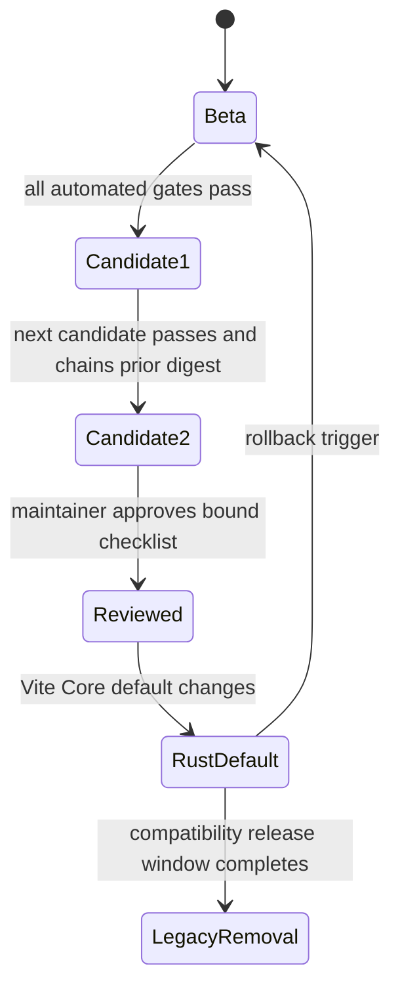

# Rust Compiler Rollout

## Purpose

The rollout exists to change compiler ownership without changing Fict language
or runtime semantics. Rust may become the Vite/Core default only after the same
candidate has passed semantic, runtime, package, performance, memory, and
rollback gates and a maintainer has reviewed that evidence.

This rollout does not graduate Preview resumability, authorize per-file
fallback, or remove the legacy compiler. Those are separate M8/M9 compatibility
units governed by [ADR-0003](../../adr/0003-retire-babel-preset.md).

## Source of truth

The machine-readable phase and default backend live in
[`compiler-rollout-state.json`](../../../.github/compiler-rollout-state.json).
Do not copy or infer the current phase from release prose. The readiness check
rejects a mismatch between that file and the Vite implementation.

## Rollout states



This state machine shows that candidate history and human review precede the
default switch, while any blocking signal returns the whole build to legacy.
Verification: `node scripts/compiler-rollout-readiness.mjs` and the
`compiler-rollout` CI job.

## Backend modes

| Mode     | Purpose                                        | Delivered output | Allowed use                                   |
| -------- | ---------------------------------------------- | ---------------- | --------------------------------------------- |
| `legacy` | Compatibility and whole-build rollback         | Babel/TypeScript | Supported during the bounded window           |
| `rust`   | Native beta and eventual Core default          | OXC/Rust         | Explicit application/CI opt-in during beta    |
| `shadow` | Compare native behavior without changing build | Legacy           | CI or an explicit local diagnostic build only |

One build MUST use one mode. A transform failure MUST NOT select another
backend for only that file. Backend selection order and accepted values are
owned by `FictPluginOptions` in the Vite plugin; `FICT_COMPILER_BACKEND` exists
as the build-level operational override.

## Shadow evidence

Shadow mode compares status, diagnostic identity/location, module metadata,
semantic event classes, helper selection, source-map integrity, structured
artifacts, and output identity. Its report contains hashes and categories only;
it MUST NOT contain source text, generated text, absolute paths, or project
names.

Expected native printer/helper differences are controlled by the versioned
[`compiler-shadow-allowlist.json`](../../../.github/compiler-shadow-allowlist.json).
Semantic categories cannot use wildcard rules. A new semantic digest requires
a fixture-level rule with a documented reason or a compiler fix.

Verification:

```bash
pnpm test:compiler:shadow
pnpm -C packages/vite-plugin test -- shadow-rollout.test.ts native-backend.test.ts
```

## Candidate evidence

The CI candidate is valid only when all evidence files report the same native
compiler build identifier:

- representative Vite shadow build with no unexplained semantic difference;
- Core runtime parity and strict-guarantee matrix;
- large-project paired/interleaved throughput and isolated peak RSS budgets;
- native Vite, Webpack, editor, playground, and real-application paths;
- successful whole-build Rust-to-legacy rollback drill.

`compiler-rollout-candidate.mjs` hashes those artifacts and chains the previous
green candidate digest. A first candidate records one green build; only a later,
distinct CI run can record two. Local smoke runs do not become release evidence.

The performance budget is owned by
[`compiler-backend-budget.json`](../../../.github/compiler-backend-budget.json).
It also owns the native tarball and npm unpacked-size ceilings. Every platform
bundle records the measured bytes, selected profile, limits, and pass/fail
result in its checksummed build evidence; bundle verification recalculates the
result before publication. Raw paired samples and platform evidence remain in
downloadable CI artifacts; documentation MUST NOT replace them with a
hand-maintained benchmark or package-size claim.

## Human review gate

The checked-in
[`compiler-rollout-review.json`](../../../.github/compiler-rollout-review.json)
is intentionally pending until a maintainer reviews a two-candidate artifact.
Approval MUST bind its `candidateDigest` and cover every listed area. The
readiness check fails if an approval is missing, incomplete, or belongs to a
different candidate.

Reviewer focus:

- Guaranteed and strict-guarantee behavior, not printer snapshots;
- TypeScript namespace/CTS ownership and cross-module metadata;
- runtime helper, metadata schema, and N-API build identity;
- source-map origins and platform-package coverage;
- p95 throughput, peak RSS, output-size, and native-package size budgets;
- proof that the rollback purges every compatibility cache and artifact.

## Monitoring and stop conditions

Compiler evidence stays local or in CI artifacts; the rollout does not add
external telemetry. Any unexplained semantic difference, native panic, ABI or
metadata mismatch, map regression, platform installation failure, performance
budget violation, or rollback-drill failure blocks promotion.

Operational recovery is defined by the
[compiler backend rollback runbook](../../operations/runbooks/compiler-backend-rollback.md).

## Verification

```bash
pnpm test:compiler:rollout-state
pnpm release:compiler:rust-rollout
pnpm release:verify:clean
```

The first command validates phase consistency. The second produces current
Rust evidence. Only the clean detached release gate can count for publishing.
Human approval remains required before changing the state to `rust-default`.

## Related decisions

- [OXC-native compiler architecture](../../architecture/rust-compiler.md)
- [ADR-0001 — Adopt an OXC-native Rust compiler](../../adr/0001-adopt-oxc-rust-compiler.md)
- [ADR-0002 — Native compiler support matrix](../../adr/0002-native-compiler-support-matrix.md)
- [ADR-0003 — Retire the Babel preset](../../adr/0003-retire-babel-preset.md)
