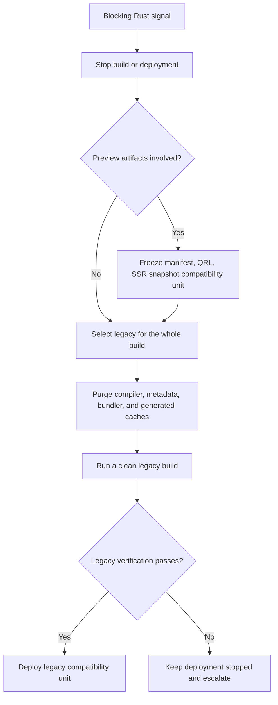

# Compiler Backend Rollback

## When to use this runbook

Rollback when a Rust build shows an unexplained Guaranteed-row behavior change,
strict-guarantee downgrade, helper/metadata ABI mismatch, false cache hit,
systematic source-map error, native panic, unsupported platform installation,
or a release-budget regression. Stop the affected build or deployment before
purging anything.

This code-level procedure applies through the final legacy release, `0.30.1`.
Fict `1.0.0` is Rust-only: it has no `legacy` selector, Babel preset, or in-tree
rollback implementation. After adopting `1.0.0`, restore a legacy build only by
pinning the compiler, runtime, integration, SSR packages, generated metadata,
and lockfile together to their `0.30.1` compatibility unit, then follow the
cache-purge and verification rules below from that pinned checkout.

## Safety rules

- Rollback MUST select `legacy` for the entire build.
- It MUST NOT retry only a failed module with legacy output.
- Rust compiler cache entries, metadata graph state, generated output, and
  Preview manifest/QRL/SSR artifacts MUST NOT enter the replacement build.
- Published dependency metadata from third-party packages is input data and
  MUST NOT be deleted; purge only application-owned caches and generated output.
- Preserve the privacy-safe shadow/candidate artifacts for diagnosis.

## Decision flow



This flow prevents a mixed build and treats Preview output as one compatibility
unit. Verification: `pnpm test:compiler:rollback-drill`.

## Procedure

1. Record the failing candidate digest, compiler build identifier, platform,
   diff category, and affected release. Do not attach source to the incident
   unless the repository's normal access policy permits it.
2. Select legacy explicitly for the replacement build:

   ```bash
   export FICT_COMPILER_BACKEND=legacy
   ```

   An explicit `backend: 'legacy'` in Vite configuration has higher precedence
   and is preferred for a committed emergency rollback.

3. Purge the configured Vite compiler cache (`<vite-cache-dir>/fict`), the
   application-owned `.fict-cache/metadata`, the configured Webpack filesystem
   cache, and every output directory from the failed Rust build. Also remove
   generated handler chunks, library metadata assets, and shadow reports from
   locations that would be copied into deploy output.
4. If Preview was involved, purge or version away the matching manifest, QRL
   chunks, SSR/PPR snapshots, CDN objects, service-worker caches, and deployment
   metadata as one unit. Do not pair a legacy client with Rust Preview output.
5. Install the intended lockfile and run a clean legacy build. Do not copy a
   previous `dist` directory or compiler cache into the workspace.
6. Run strict-guarantee, bundler, runtime, and affected application tests. Check
   that the replacement artifact contains no Rust candidate build identifier
   and that every module came from the selected backend.
7. Deploy the complete legacy artifact set, then preserve the Rust failure
   fixture and privacy-safe evidence for remediation.

## Automated drill

The drill creates an isolated temporary Vite project, builds it with Rust,
plants cache/sidecar sentinels, purges the compatibility unit, rebuilds with
legacy, and emits digest-only evidence:

```bash
pnpm test:compiler:rollback-drill
```

It proves cache removal and backend isolation; it does not authorize a real
deployment. Release infrastructure owners must separately verify CDN, remote
cache, and deployment-store invalidation for their environment.

## Verification

```bash
FICT_COMPILER_BACKEND=legacy pnpm test:bundlers:strict-guarantee
FICT_COMPILER_BACKEND=legacy pnpm test:e2e
pnpm test:compiler:rollout-state
```

Expected outcome: the clean legacy build and application behavior pass, no Rust
sidecar/handler artifact is reused, and the rollout state still records legacy
as the rollback backend.

## Escalation and human review

Escalate instead of deploying when legacy verification also fails, the cache
owner cannot be identified, a Preview compatibility unit cannot be purged
atomically, or a published package mixes compiler build identifiers. A
maintainer must review the incident before Rust promotion resumes.

## Related documents

- [Rust compiler rollout](../../features/rust-compiler-rollout/rollout.md)
- [Rust compiler architecture](../../architecture/rust-compiler.md)
- [Release verification](../../testing/release-verification.md)
- [SSR deployment cache rules](../../ssr-deployment.md)
